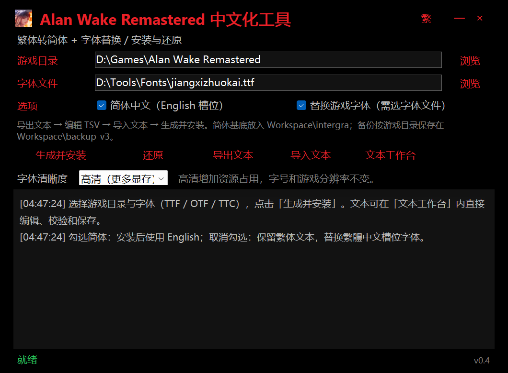
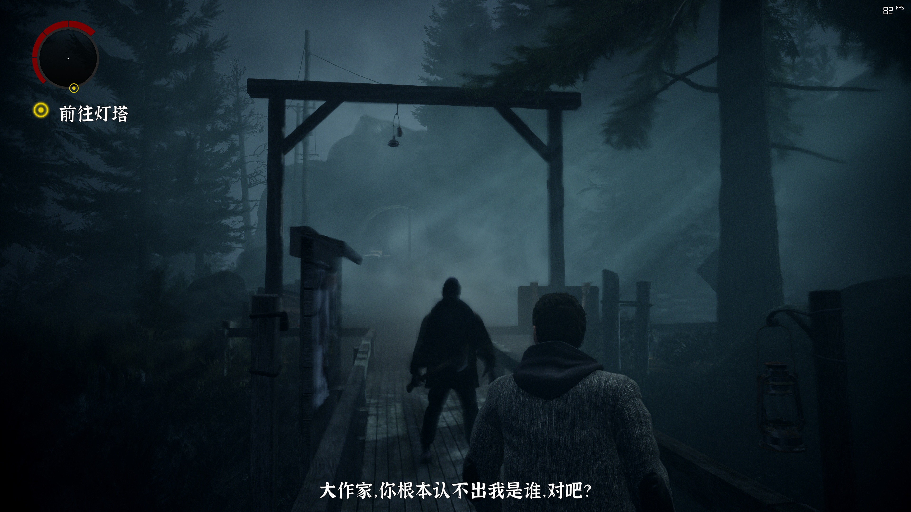

<div align="center">

# AWRChineseTool

### 《心灵杀手：重制版》简体中文 + 楷体字体替换工具

[](../../releases)
[](LICENSE)



</div>

## 功能概览

### 字体替换

将任意 `.ttf` TrueType 字体（需含简体中文字形）烘焙为游戏原生 `.binfnt` 位图图集格式并替换。支持字符集自动扩展、mip 链、kerning 段，与原版字体格式逐字节兼容。

### 简体文本

基于 intergra 简体译文基底 + OpenCC 词典链润色。覆盖游戏全部 6000+ 条文本（菜单、任务、手稿、字幕、成就等）。字符映射表逐字形精确重排，非简单像素覆盖。

### 文本工作台

内置可视化编辑器，支持搜索、筛选、批量导入/导出 TSV、逐条校验。用户可在导出的简体文本上直接润色，保存后一键安装生效。

### 一键还原

安装时自动备份原版文件。一键还原到原始状态，或通过 Epic「验证」恢复。

## 游戏截图




## 使用方法

1. 选择游戏根目录（含 `data\` 文件夹）
2. 可选：选择一款 `.ttf` 简体字体
3. 勾选「转换为简体中文」和/或「替换游戏字体」
4. 点击「生成并安装」
5. 游戏内语言切换为 **English**（EN 槽位显示简体中文）

安装后进游戏确认效果。如需润色译文：点击「导出文本」→ 编辑 TSV →「导入文本」→ 再次「生成并安装」。

### 还原

点击「还原」按钮将备份文件复制回游戏目录；或通过 Epic「验证」恢复。

## 命令行

```text
AWRChineseTool install <game> [font.ttf] [--simplified]
AWRChineseTool restore <game>
AWRChineseTool export-text <game>
AWRChineseTool validate-game <game>
```

## 技术细节

- **容器**：Northlight 引擎 `.bin/.rmdp` V2 大端格式；支持列表、解包、重打包、逐字节往返校验。
- **字体**：`.binfnt` V4（顶点 + 索引 + 度量 + 字符映射 + DDS BGRA8888）；布局参照原版 EN 槽位字体（`[vertOff][4][idxOff][6]` 条目 + 空 kern 段）。
- **文本**：`string_table.bin` = `u32 count` + N × (`u32 len` + ASCII id + `u32 len` + UTF-16LE)。
- **繁→简**：OpenCC 词典链 `TWPhrasesRev → TWVariantsRevPhrases → TWVariantsRev → TSPhrases → TSCharacters`（Apache-2.0）。

## 致谢

- 简体中文文本基底：[intergra/AlanWakeRemastered_Simplified_Chinese](https://github.com/intergra/AlanWakeRemastered_Simplified_Chinese)
- OpenCC 词典：[BYVoid/OpenCC](https://github.com/BYVoid/OpenCC)（Apache-2.0）
- 字体格式研究：[OpenAWE-Project/OpenAWE](https://github.com/OpenAWE-Project/OpenAWE)（GPL-3.0）

## 构建

```text
dotnet publish -c Release -r win-x64 --self-contained true -p:PublishSingleFile=true -o publish
```

## 许可

MIT License（工具代码）；OpenCC 词典 Apache-2.0；字体文件版权归各自权利人所有。
